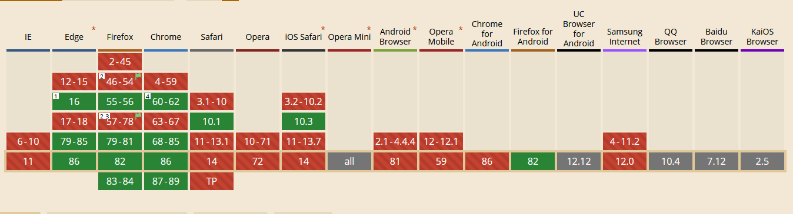

# 浏览器 .avi视频播放demo
# 
- [ffmpeg项目作者github:](https://github.com/ffmpegwasm/ffmpeg.wasm)
- cdn资源1：https://unpkg.com/browse/@ffmpeg/ffmpeg@0.9.4/dist/
- cdn资源2：https://unpkg.com/browse/@ffmpeg/core@0.8.3/dist/
- 本项目的ffmpeg.min.js每个版本所依赖的ffmpeg-core.js都不一样，
- 如项目运行在内网环境，需要手动下载资源2里面的所有文件

**注意：**
```javascript
	const ffmpeg = createFFmpeg({
		log: false,
		//corePath: './js/lib/ffmpeg-core.js', //如果是内网环境，释放此处，加载本地 ffmpeg-core库，否则加载的是资源2
	});
```

**注意：**
- 经测试，ffmpeg库不支持谷歌32位版本，
- 还不支持这些：
**兼容性视图**
